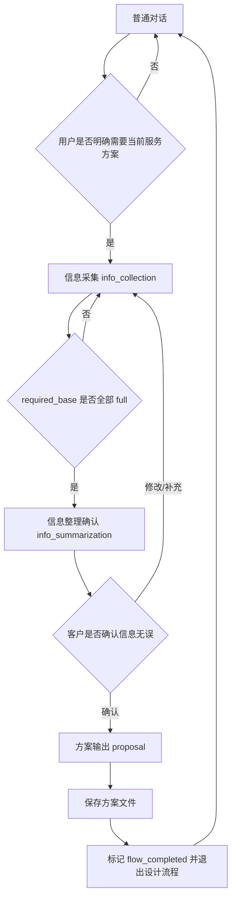

# 售前设计流程架构与决策记录

更新时间：2026-05-08  
状态：当前实现已切换为“服务目录 + 模板 + slots.yaml”驱动。

## 0. 定位与边界

Presales 业务层用于一类可模板化交付的售前服务：先与客户正常对话，客户明确需要某项服务后进入信息采集，slot 满足后整理信息并让客户确认，确认后按模板生成方案、保存本地文件，并退出设计流程回到正常对话。

不解决的问题：

1. 不在代码里定义具体业务 slot。
2. 不让模型自由发挥服务范围。
3. 不在方案输出后继续要求客户二次确认保存。
4. 不用 RAG 替代客户需求证据。

## 1. 当前实施状态

### 1.1 已完成

| 功能 | 状态 | 当前实现 | 主要代码/文件 |
| --- | --- | --- | --- |
| 服务目录驱动 | 已完成 | 启动时扫描 `presales_services/<服务名>/`，读取 `proposal.md` 与 `slots.yaml` | `run_agent.py` |
| 服务介绍约束 | 已完成 | 服务名来自服务目录/模板标题，用户问服务时只介绍目录内服务 | `run_agent.py`, `presales_services/` |
| Slot 文件化 | 已完成 | slot 清单不再写在 `config.py` 或代码默认值中，业务 slot 来自 `slots.yaml` | `presales_services/<服务名>/slots.yaml`, `agent/presales_policy.py` |
| 结构化槽位评估 | 已完成 | 用户本轮输入 -> LLM JSON 结构化评估 -> 校验 slot schema -> 写入状态 | `run_agent.py`, `agent/presales_policy.py` |
| 单一路径写槽 | 已完成 | 不再把用户原文直接 fallback 写入 focus slot | `run_agent.py` |
| 冲突确认 | 已完成 | 新旧值冲突时写入 `pending_conflict`，向客户确认以哪个为准 | `run_agent.py` |
| 多问题采集 | 已完成 | 信息采集阶段按缺失 slot 清单生成编号问题列表 | `run_agent.py` |
| 旁路问答 | 已完成 | 设计流程中客户问无关问题时可先回答，再回主线 | `run_agent.py` |
| 信息确认 | 已完成 | slot 满足后进入信息整理阶段，让客户自然语言确认或提出修改 | `agent/presales_summarizer.py`, `run_agent.py` |
| 方案输出并保存 | 已完成 | 客户确认信息后生成方案，写入本地文件，标记完成并退出流程 | `run_agent.py`, `agent/presales_proposal.py` |
| RAGFlow 工具接入 | 已完成 | 支持 `ragflow_completion`，并做输出清洗 | `tools/ragflow_tool.py` |
| 模板 RAG 填充 | 已完成 | 方案模板阶段可对多个 `{{rag}}` 条目生成 query 并检索 | `run_agent.py`, `agent/presales_proposal.py` |
| 模板 AI 填充 | 已完成 | `{{ai}}` 根据条目名、slot 和上下文生成内容 | `run_agent.py`, `agent/presales_proposal.py` |
| 阶段状态机 | 已完成 | `info_collection -> info_summarization -> proposal` | `agent/presales_state_machine.py` |

### 1.2 当前验证

已运行：

```bash
scripts/run_tests.sh tests/run_agent/test_run_agent.py tests/agent/test_presales_policy.py -q
```

结果：

```text
323 passed, 4 warnings
```

重点验证点：

1. 服务目录中的 `slots.yaml` 会覆盖并成为当前 slot schema。
2. `config.py` 中不再保存业务 slot 清单。
3. 没有 `slots.yaml` 时不会默默回退到某个业务默认槽位。
4. 用户问“有什么服务”时会注入服务目录上下文。
5. 信息确认后方案当轮生成、保存并退出流程。
6. 完成流程后后续消息不会重复生成方案。
7. 结构化评估只接受 schema 中的 slot。
8. 单轮 RAG 限流与 query 缓存仍有效。

## 2. 文件与配置模型

### 2.1 业务文件结构

当前业务配置源是项目目录中的服务总目录：

```text
presales_services/
  客户专属穿搭服务/
    proposal.md
    slots.yaml
```

规则：

1. `presales_services/` 只放服务目录。
2. 每个服务目录名就是服务名。
3. `proposal.md` 是该服务的方案模板。
4. `slots.yaml` 是该服务的信息采集目标。
5. 当前先选择扫描到的第一个服务为 active service；后续可扩展显式选择服务。

### 2.2 slots.yaml 结构

```yaml
id: 客户专属穿搭服务
required_base:
  - customer_name
  - height_cm
  - weight_kg
required_for_handoff: []
optional: []
meta:
  customer_name:
    label: 客户姓名
    desc: 客户称呼或姓名（用于方案抬头）
  height_cm:
    label: 身高
    desc: 身高（厘米 cm）
```

字段含义：

1. `id`：服务名，通常与目录名一致。
2. `required_base`：必须补齐的 slot；全部满足后进入信息整理。
3. `required_for_handoff`：预留的额外交付门槛。
4. `optional`：可选 slot，不阻塞流程。
5. `meta`：slot 说明，用于 LLM 评估、自动追问和展示。

### 2.3 ~/.hermes/config.yaml 只放运行参数

示例：

```yaml
agent:
  presales_enabled: true
  presales_state_machine_enabled: true
  presales_answer_gate_enabled: true
  presales_slot_assessment_mode: llm_structured
  presales_template_rag_max_calls_per_turn: 4
```

这些不是业务 slot 定义。业务 slot 不放在 `~/.hermes/config.yaml`。

## 3. 核心状态机

当前设计流程只有三个业务阶段，流程外状态由 `state.in_flow` 表示。



阶段说明：

1. `in_flow=false`：正常售前对话。可以回答服务范围、RAG 问答、闲聊式咨询，但不采集 slot。
2. `info_collection`：只围绕缺失 slot 采集信息。客户问旁路问题时先回答，再继续提问缺失项。
3. `info_summarization`：输出已确认信息清单。客户确认则进入方案输出；客户修改则回到采集。
4. `proposal`：按模板生成方案并写入本地文件。同一轮标记完成并退出流程。

## 4. Slot 证据与写入规则

### 4.1 单一写入路径

用户输入不会被代码直接写入 slot。唯一主路径是：

```text
用户本轮输入
  -> LLM 结构化评估 JSON
  -> 校验 slot 是否在 slots.yaml schema 中
  -> merge_slot_assessments
  -> 写入 state.slots
```

### 4.2 状态语义

每个 slot 的评估状态：

1. `none`：没有可用信息。
2. `partial`：相关但不足以满足。
3. `full`：有明确证据，可用于方案。

只有 `full` 参与覆盖率与阶段推进。

### 4.3 冲突语义

当同一 slot 出现新旧不一致：

1. 语义等价则自动归一。
2. 非等价且策略要求确认时，写入 `pending_conflict`。
3. 输出冲突确认问句，让客户选择以哪个为准。
4. 未解决前不继续覆盖该 slot。

## 5. 方案模板渲染

模板支持五类变量：

1. `{{slot:key}}`：客户已确认信息。
2. `{{sys:name}}`：系统信息，如 `date`、`datetime`、`session_id`。
3. `{{rag:query}}` 或 `{{rag}}`：知识库检索结果。
4. `{{ai}}` 或 `{{ai:instruction}}`：根据条目名和上下文生成内容。
5. `{{ext:...}}`：预留外部接口/skills/tool 数据。

渲染原则：

1. 取不到值就留空。
2. 不编造报价、政策、事实数据。
3. 报价/政策优先通过 RAG 或 ext 获取。
4. 事实字段用 slot/sys/rag/ext，表达性字段可用 ai。

## 6. RAG 策略

普通对话：

1. 可回答客户任何阶段提出的问题。
2. 若需要知识库，走 RAGFlow。
3. 单轮检索受 `ragflow_single_retrieval_mode` 和 `ragflow_max_calls_per_turn` 约束。

方案模板：

1. `{{rag}}` 条目会结合条目名、slot 信息和近期对话生成最终 query。
2. 模板阶段可一次填充多个 `rag` 条目。
3. 检索失败留空，不编造。

## 7. 代码落点

1. [`run_agent.py`](/Users/aaron/Documents/augment-projects/persenal/hermes-agent/run_agent.py)
   - 服务目录扫描：`_presales_services_root()`、`_presales_service_dirs()`、`_compile_presales_templates()`。
   - 服务目录上下文：`_presales_service_catalog_context()`。
   - turn start 编排：`_presales_on_turn_start()`。
   - 最终回答门控与阶段推进：`_presales_apply_answer_gate()`。
   - 模板 RAG/AI 填充：`_presales_render_proposal_from_template()`。
2. [`agent/presales_policy.py`](/Users/aaron/Documents/augment-projects/persenal/hermes-agent/agent/presales_policy.py)
   - slot schema 解析、结构化评估解析、slot merge、覆盖率计算。
   - 默认业务 slot 为空，避免代码定义业务域。
3. [`agent/presales_state_machine.py`](/Users/aaron/Documents/augment-projects/persenal/hermes-agent/agent/presales_state_machine.py)
   - 三阶段状态机。
4. [`agent/presales_summarizer.py`](/Users/aaron/Documents/augment-projects/persenal/hermes-agent/agent/presales_summarizer.py)
   - 信息整理确认文本。
5. [`agent/presales_proposal.py`](/Users/aaron/Documents/augment-projects/persenal/hermes-agent/agent/presales_proposal.py)
   - 模板占位符解析与基础渲染。
6. [`tools/ragflow_tool.py`](/Users/aaron/Documents/augment-projects/persenal/hermes-agent/tools/ragflow_tool.py)
   - RAGFlow 工具调用与结果清洗。
7. [`hermes_cli/config.py`](/Users/aaron/Documents/augment-projects/persenal/hermes-agent/hermes_cli/config.py)
   - 只保留运行参数和 `presales.services_dir` 默认值，不保存业务 slot 清单。

## 8. 测试落点

1. [`tests/run_agent/test_run_agent.py`](/Users/aaron/Documents/augment-projects/persenal/hermes-agent/tests/run_agent/test_run_agent.py)
   - 服务目录加载、服务目录注入、状态机接线、方案保存退出、RAG 限流等。
2. [`tests/agent/test_presales_policy.py`](/Users/aaron/Documents/augment-projects/persenal/hermes-agent/tests/agent/test_presales_policy.py)
   - slot 解析、merge、覆盖率、partial/full 语义。
3. [`tests/agent/test_presales_state_machine.py`](/Users/aaron/Documents/augment-projects/persenal/hermes-agent/tests/agent/test_presales_state_machine.py)
   - 阶段迁移规则。
4. [`tests/agent/test_presales_proposal_template_vars.py`](/Users/aaron/Documents/augment-projects/persenal/hermes-agent/tests/agent/test_presales_proposal_template_vars.py)
   - 模板变量渲染。

## 9. 当前非目标与后续扩展

当前暂不做：

1. 多服务选择策略。
2. 服务目录热加载。
3. 外部接口 `ext` 的真实 tool 白名单和权限模型。
4. Dashboard 配置编辑器。

后续可扩展：

1. `slots.yaml` 中支持 `default: true` 标记默认服务。
2. 根据用户需求自动选择服务目录。
3. 将 presales 业务层进一步插件化，减少对 `run_agent.py` 的侵入。
4. 增加服务目录校验命令，例如检查模板 slot 是否都在 `slots.yaml` 中定义。
